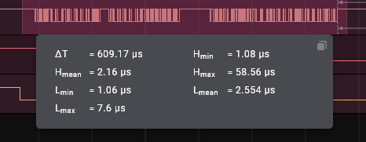

  # Pulse Stats

**Pulse Stats** is a Logic2 extension that adds simple high and low pulse statistics
to digital measurements.

## Instructions

Install **PulseStats** by clicking "Install" on the **Pulse Stats** entry in the
Extensions panel.

To add a measurement you can:

1. Click on the Measurements "+" icon in the "Annotations panel", then click on
    the "Add Measurement Ctrl+G" popup button, then drag over the digital data
    you want to measure, or
2. Press Ctrl+G then drag over the digital data you want to measure, or
3. Shift drag over the digital data you want to measure

Dismiss the measurement popup dialog by clicking outside any selection.

Show the measurement popup dialog for a selection by clicking on the selection.

You may also view measurement data by opening the measurement pane by clicking
on the ruler icon in the right hand side panel buttons area.

